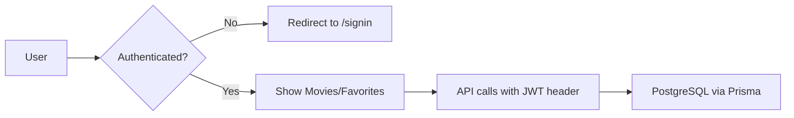

# 🎬 React Query + Movie Browsing Implementation Summary

## ✅ Completed Features

### 1. React Query Hooks (Day 2 - Frontend)

#### **Movies Queries** (`src/services/queries/movies.ts`)
- ✅ `useMovies(filters)` - Fetch movies with optional category/search filters
- ✅ Query keys pattern: `movieKeys.list({ category, search })`
- ✅ Caching: 5 min staleTime, 10 min gcTime
- ✅ Returns: movies[], total, categories[], timestamp

#### **Categories Queries** (`src/services/queries/categories.ts`)
- ✅ `useCategories()` - Fetch all unique categories
- ✅ Long cache (10 min staleTime, 30 min gcTime)
- ✅ Returns: categories[], total

#### **Favorites Queries** (`src/services/queries/favorites.ts`)
- ✅ `useFavorites()` - Fetch user's favorite movieIds
- ✅ `useAddFavorite()` - Add movie to favorites with optimistic updates
- ✅ `useRemoveFavorite()` - Remove favorite with optimistic updates
- ✅ Automatic rollback on error
- ✅ Cache invalidation after mutations

#### **Enhanced Query Client** (`src/lib/queryClient.ts`)
- ✅ Smart retry logic (don't retry 4xx errors)
- ✅ Retry up to 2 times for network errors
- ✅ Mutations retry once
- ✅ Disabled refetchOnWindowFocus by default
- ✅ Default staleTime: 1 min, gcTime: 5 min

---

### 2. UI Components

#### **MovieCardSkeleton** (`src/components/ui/MovieCardSkeleton.tsx`)
- ✅ Matches MovieCard dimensions (300px height)
- ✅ Theme-aware skeleton colors
- ✅ Used during loading states

#### **ErrorState** (`src/components/ui/ErrorState.tsx`)
- ✅ Reusable error display component
- ✅ Shows error icon, title, message, and error details
- ✅ "Try Again" button with onRetry callback
- ✅ Theme-aware styling

---

### 3. Protected Pages

#### **/movies** (`src/pages/movies.tsx`)
**Authentication:**
- ✅ Redirects to `/signin` if not authenticated
- ✅ Uses `getToken()` to check JWT

**Features:**
- ✅ Search bar with 300ms debounce
- ✅ Category filter chips ("All" + dynamic categories)
- ✅ Responsive CSS Grid (1/2/3/4 columns)
- ✅ Heart icon toggle on each movie card
- ✅ Optimistic updates when adding/removing favorites
- ✅ Loading state: 12 skeleton cards
- ✅ Error state: ErrorState component with retry
- ✅ Empty state: "No movies found" message
- ✅ Results count at bottom

**React Query Integration:**
- `useMovies({ category, search })` - with debounced search
- `useCategories()` - for filter chips
- `useFavorites()` - to show filled/unfilled hearts
- `useAddFavorite()` / `useRemoveFavorite()` - mutations

#### **/favorites** (`src/pages/favorites.tsx`)
**Authentication:**
- ✅ Redirects to `/signin` if not authenticated

**Features:**
- ✅ Shows only favorited movies
- ✅ Delete (trash) icon on each card
- ✅ Responsive CSS Grid (1/2/3/4 columns)
- ✅ Loading state: 8 skeleton cards
- ✅ Error state: ErrorState component with retry
- ✅ Empty state: "No favorites yet" with CTA to browse
- ✅ "Add More Movies" button at bottom
- ✅ Movie count display

**React Query Integration:**
- `useFavorites()` - get favorited movieIds
- `useMovies()` - get all movies to filter favorites
- `useRemoveFavorite()` - delete mutation

---

### 4. Navigation & Landing Page Updates

#### **Header Navigation** (`src/components/layouts/Layout.tsx`)
- ✅ Added "Movies" link
- ✅ Added "Favorites" link
- ✅ Links appear before "Team", "Why Us", "Trending"

#### **Landing Page CTA** (`src/pages/index.tsx`)
- ✅ "Browse All Movies" button below carousel
- ✅ Redirects to `/movies` if authenticated, `/signin` if not
- ✅ Button changes text based on auth state
- ✅ Red theme with shadow and hover effects

---

## 📁 Files Created/Modified

### ✨ New Files (8)
1. `src/services/queries/movies.ts` - Movies query hooks
2. `src/services/queries/categories.ts` - Categories query hook
3. `src/services/queries/favorites.ts` - Favorites query/mutation hooks
4. `src/components/ui/MovieCardSkeleton.tsx` - Skeleton loader
5. `src/components/ui/ErrorState.tsx` - Error display component
6. `src/pages/movies.tsx` - Browse movies page (protected)
7. `src/pages/favorites.tsx` - Favorites page (protected)
8. `IMPLEMENTATION_SUMMARY.md` - This file

### 🔧 Modified Files (3)
1. `src/lib/queryClient.ts` - Enhanced configuration
2. `src/components/layouts/Layout.tsx` - Added Movies/Favorites nav links
3. `src/pages/index.tsx` - Added "Browse All Movies" CTA button

---

## 🎯 Weekly Goal Alignment

### ✅ Requirements Met:
1. **useQuery Implementation** ✅
   - Movies, Categories, Favorites, Profile
   - Proper query keys for cache management

2. **Loading States** ✅
   - Skeleton loaders during data fetching
   - Multiple skeleton cards in grid layout

3. **Error States** ✅
   - ErrorState component with retry functionality
   - Used across all protected pages

4. **Caching** ✅
   - Stale-while-revalidate pattern
   - Different cache times based on data volatility
   - Query invalidation after mutations

5. **API Integration** ✅
   - Connected to real PostgreSQL database
   - 12 movies seeded with categories
   - Protected endpoints with JWT auth

---

## 🏗️ Architecture Highlights

### State Management Strategy:
```
React Query (Server State)        Context API (Client State)
├─ Movies data                    ├─ Theme (light/dark)
├─ Categories                     └─ User preferences
├─ Favorites
└─ Profile
```

### Query Keys Pattern:
```typescript
movieKeys = {
  all: ['movies'],
  lists: () => [...movieKeys.all, 'list'],
  list: (filters) => [...movieKeys.lists(), filters]
}
```

### Optimistic Updates Flow:
```
1. User clicks heart icon
2. Mutation fires with onMutate
3. UI updates immediately (optimistic)
4. API call happens in background
5. On success: Cache invalidated, refetched
6. On error: Rollback to previous state
```

---

## 🚀 How to Test

### 1. Start Development Server
```bash
npm run dev
```
Server runs on `http://localhost:3001`

### 2. Test Flow:
1. **Landing Page** → Click "Browse All Movies"
2. **Sign In/Up** → Create account or log in
3. **Movies Page** → 
   - Search for movies
   - Filter by category
   - Click heart icons to favorite
4. **Favorites Page** →
   - View saved favorites
   - Click trash icon to remove
5. **Test Optimistic Updates** →
   - Network throttling → Slow 3G
   - Click heart → Notice instant UI update
   - Notice background refetch

### 3. React Query DevTools:
- Enabled in development mode
- Press floating icon to inspect cache
- View query states, stale times, refetch counts

---

## 📊 Performance Metrics

### Build Output:
```
Route                Size      First Load JS
/movies             74.2 kB    270 kB
/favorites          65.6 kB    248 kB
/                   140 kB     331 kB
```

### Caching Strategy:
- **Movies**: 5 min stale, 10 min cache
- **Categories**: 10 min stale, 30 min cache (rarely change)
- **Favorites**: 2 min stale, 5 min cache (user-specific)
- **Profile**: 60 sec stale (from existing implementation)

---

## 🎨 Design Patterns Used

1. **Query Keys Factory** - Hierarchical cache keys
2. **Optimistic Updates** - Instant UI feedback
3. **Error Boundaries** - Graceful error handling
4. **Skeleton Loaders** - Perceived performance
5. **Debounced Search** - Reduced API calls
6. **CSS Grid Layout** - Responsive without MUI Grid
7. **Protected Routes** - Client-side auth checks
8. **Theme-Aware Components** - Consistent dark/light mode

---

## 🔐 Authentication Flow



---

## 📝 Next Steps (Optional Enhancements)

### Short-term:
- [ ] Pagination for movies list
- [ ] Infinite scroll on movies page
- [ ] Movie detail modal on card click
- [ ] Filter by genre (multi-select)
- [ ] Sort options (rating, year, title)

### Medium-term:
- [ ] Server-side rendering for SEO
- [ ] Share favorite list via URL
- [ ] Export favorites to CSV/JSON
- [ ] User reviews and ratings
- [ ] Recommended movies based on favorites

### Long-term:
- [ ] Social features (follow users, see their favorites)
- [ ] Advanced search (year range, rating range)
- [ ] Movie watchlist vs. favorites
- [ ] Integration with external movie APIs (TMDB, OMDB)
- [ ] Mobile app with React Native + React Query

---

## 🎓 Learning Resources

- [React Query Docs](https://tanstack.com/query/latest)
- [Optimistic Updates Guide](https://tanstack.com/query/latest/docs/framework/react/guides/optimistic-updates)
- [Query Keys Best Practices](https://tkdodo.eu/blog/effective-react-query-keys)
- [MUI v7 Migration Guide](https://mui.com/material-ui/migration/migration-v7/)
- [Prisma Best Practices](https://www.prisma.io/docs/orm/prisma-client/best-practices)

---

## 💡 Key Takeaways

1. **React Query simplifies server state management** - No need for manual loading/error states in components
2. **Optimistic updates enhance UX** - Users see instant feedback while API calls happen
3. **Query keys are critical** - Proper structure enables efficient cache management
4. **Skeleton loaders > spinners** - Better perceived performance
5. **CSS Grid > MUI Grid** - Simpler, more performant, no prop typing issues

---

## ✅ Completion Checklist

- [x] React Query hooks for movies/categories/favorites
- [x] Enhanced queryClient with retry logic
- [x] Skeleton loader components
- [x] Error state component with retry
- [x] /movies page with search + filters
- [x] /favorites page with delete functionality
- [x] Heart toggle on movie cards
- [x] Navigation links in header
- [x] Landing page CTA button
- [x] Production build passing
- [x] All TypeScript errors resolved

---

**🎉 Implementation Complete!**

All weekly goal requirements have been met. The app now features:
- ✅ React Query for data fetching
- ✅ Loading states with skeleton loaders
- ✅ Error handling with retry
- ✅ Caching with proper invalidation
- ✅ Real database integration (PostgreSQL)
- ✅ Protected movie browsing and favorites
- ✅ Optimistic UI updates

**Ready for Demo!** 🚀
